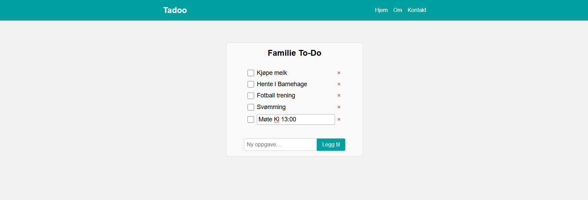

Tadoo

Tadoo is a simple family To-Do app built with Angular. All tasks are stored locally in the browser’s localStorage. You can add, edit, and check off tasks without any external database. This was my very first Angular project, and it helped me learn the core concepts—components, services, and two-way data binding with ngModel—while structuring a basic application from scratch. It’s still a work in progress, and I’ll be adding more changes and features as I continue learning.

Features

• Add Tasks: Enter a task title and click “Add” or press Enter to create a new task.
• Edit Tasks: Click on a task title to edit inline; press Enter or click outside to save.
• Mark Complete: Check or uncheck the checkbox to toggle a task’s completed state.
• Delete Tasks: Remove tasks by clicking the “×” button or by clearing the text in edit mode.
• Local Storage: All tasks persist in localStorage so they remain after page reload or browser restart.
• Responsive Layout: Simple header, main content, and footer layout that adapts to most screen widths.

Demo

Currently no live demo deployed. You can run the app locally following the instructions below.
Getting Started
Prerequisites
• Node.js (version ≥ 16.x recommended)
• npm (version ≥ 8.x)
• Angular CLI (version ≥ 16):
  
  npm install -g @angular/cli

Installation

Clone this repository:
  git clone https://github.com/robfil50219/tadoo.git
  cd tadoo

Install dependencies:

  npm install

Running the App Locally

Build and serve:

  ng serve

Open in Browser:

  Navigate to http://localhost:4200 to view the app.

The development server will automatically reload if you change any source files.

Usage

Add a Task:

  - Type your task in the “New task…” input field and press Enter or click the “Add” button. The task appears in the list and is saved to localStorage.

Edit a Task:

  - Click on a task’s title. The title becomes editable. Modify the text, then press Enter or click outside the input to save. If you clear all text and save, the task is deleted.

Toggle Completion:

  - Click the checkbox to mark a task as completed or uncompleted. Completed tasks display with a line-through style.

Delete a Task:

  - Click the red “×” on the right side of a task to delete it immediately.

Project Structure

tadoo/
├── dist/                      # Compiled output (after ng build)
├── node_modules/              # npm dependencies
├── src/
│   ├── app/
│   │   ├── app.html            # Root component template
│   │   ├── app.scss            # Root component styles
│   │   ├── app.ts              # Root standalone component
│   │   ├── services/
│   │   │   └── todo.ts         # TodoService (stores tasks in localStorage)
│   │   └── todo-list/
│   │       ├── todo-list.html  # TodoList component template
│   │       ├── todo-list.scss  # TodoList component styles
│   │       └── todo-list.ts    # TodoList standalone component logic
│   ├── assets/                 # Static assets (images, fonts, etc.)
│   ├── environments/           # Environment configuration files
│   │   ├── environment.ts
│   │   └── environment.prod.ts
│   ├── index.html              # Main HTML file
│   ├── main.ts                 # Bootstraps the root component
│   ├── polyfills.ts            # Polyfills needed by Angular
│   ├── styles.scss             # Global styles (reset + defaults)
│   └── test.ts                 # Test setup (unused in this simple project)
├── angular.json                # Angular CLI configuration
├── package.json                # npm scripts & dependencies
├── tsconfig.json               # TypeScript configuration
└── README.md                   # This file

Technologies Used

• Angular (v20.0.0)
• TypeScript
• RxJS (for BehaviorSubject and Observable)
• SCSS (component and global styling)
• LocalStorage (browser API for persisting tasks)
• Angular CLI (project scaffolding, build, serve)

Future Improvements

• Category tags: Assign categories (e.g., Shopping, Chores) to tasks and filter by category.
• Due dates & reminders: Add date picker support so tasks can have deadlines.
• Import/Export JSON: Allow users to export the entire task list as a JSON file and import it on another device.
• User authentication & cloud sync: Integrate Firebase (or another backend) to enable multiple family members to sync tasks in real time.
• Responsive design enhancements: Fine-tune CSS/SCSS to improve layout on tablets and small mobile screens.
• Unit & integration tests: Add Angular testing (Karma/Jasmine) for components and services.

License

This project is released under the MIT License.