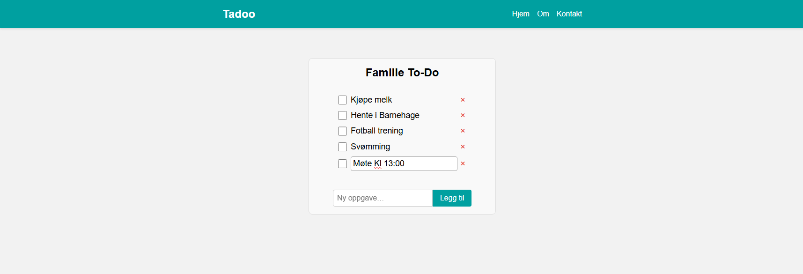

# Tadoo - Family Task Manager (Next.js Version)

> A modern family task management app built with Next.js, React, and Firebase.



## Features

- ✅ **Add Tasks**: Create tasks and assign them to family members
- ✅ **Edit Tasks**: Click to edit task titles inline
- ✅ **Mark Complete**: Check off completed tasks
- ✅ **Delete Tasks**: Remove tasks you no longer need
- ✅ **Family Management**: Add family members with different roles (adult/child)
- ✅ **Task Assignments**: Assign tasks to specific family members
- ✅ **Local Storage**: Tasks persist in browser storage
- ✅ **Multi-language**: Support for English, Norwegian, Swedish, and Danish
- ✅ **Responsive Design**: Works on desktop, tablet, and mobile
- 🚀 **Real-time Sync**: Firebase integration for cloud sync (coming soon)
- 📱 **Location Tracking**: Family location sharing (coming soon)
- 💬 **Family Chat**: In-app messaging (coming soon)
- 📅 **Calendar View**: Task calendar integration (coming soon)

## Tech Stack

- **Frontend**: React 18, Next.js 14, TypeScript
- **State Management**: Zustand
- **Styling**: SCSS
- **Backend**: Firebase (Firestore, Authentication)
- **Deployment**: Vercel, Firebase Hosting, or Docker

## Getting Started

### Prerequisites

- Node.js 18+ 
- npm 9+

### Installation

```bash
# Clone the repository
git clone https://github.com/robfil50219/tadoo.git
cd tadoo

# Install dependencies
npm install

# Set up environment variables
cp .env.example .env.local
# Edit .env.local with your Firebase config (optional for demo mode)

# Run development server
npm run dev
```

Open [http://localhost:3000](http://localhost:3000) in your browser.

### Build for Production

```bash
npm run build
npm start
```

## Project Structure

```
app/                    # Next.js app directory
├── layout.tsx         # Root layout
├── page.tsx           # Main app page
├── page.scss          # App styles
├── globals.scss       # Global styles

components/            # React components
├── Navigation.tsx     # Navigation sidebar
├── AuthModal.tsx      # Auth UI
└── views/             # Page views
    ├── Dashboard.tsx
    ├── TasksList.tsx
    ├── Calendar.tsx
    ├── Family.tsx
    ├── Chat.tsx
    ├── Location.tsx
    └── Settings.tsx

lib/                   # Utilities and hooks
├── config/
│   └── firebase.ts    # Firebase config
├── store/
│   └── todoStore.ts   # Zustand store
└── hooks/
    ├── useAuth.ts     # Auth hook
    └── useLanguage.ts # Language hook
```

## Usage

### Add a Task

1. Go to the **Tasks** section
2. Enter a task title
3. Select the assignee
4. Click "Add Task"

### Edit a Task

Click the task title to edit it inline. Press Enter or click outside to save.

### Complete a Task

Click the checkbox next to the task to mark it as complete.

### Delete a Task

Click the "×" button on the right side of the task.

## Migration from Angular

This project has been migrated from Angular to Next.js. See [MIGRATION.md](./MIGRATION.md) for detailed information about the changes and architectural differences.

## Demo Mode

The app runs in **demo mode** by default with sample family data:
- Family: "Familien Filep"
- Members: Robert (adult), Maria (adult), Emma (child), Leo (child)
- Sample tasks demonstrating different categories and priorities

Data is stored locally in your browser's localStorage.

## Firebase Setup (Optional)

To enable cloud sync and real authentication:

1. Create a Firebase project at https://console.firebase.google.com
2. Copy your Firebase config
3. Add to `.env.local`:
```
NEXT_PUBLIC_FIREBASE_API_KEY=your_key
NEXT_PUBLIC_FIREBASE_AUTH_DOMAIN=your_domain
NEXT_PUBLIC_FIREBASE_PROJECT_ID=your_project
NEXT_PUBLIC_FIREBASE_STORAGE_BUCKET=your_bucket
NEXT_PUBLIC_FIREBASE_MESSAGING_SENDER_ID=your_sender_id
NEXT_PUBLIC_FIREBASE_APP_ID=your_app_id
```
4. Restart the dev server

## Future Enhancements

- 🔐 Firebase Authentication integration
- ☁️ Cloud synchronization (Firestore)
- 📍 Real-time location tracking
- 💬 Family chat/messaging
- 📅 Calendar integration
- 🔔 Task reminders and notifications
- 📊 Task statistics and analytics
- 🎨 Theme customization
- 📱 Progressive Web App (PWA)

## Deployment

### Vercel (Recommended)

```bash
npm i -g vercel
vercel
```

### Netlify

```bash
npm run build
npm install -g netlify-cli
netlify deploy --prod --dir=.next
```

### Firebase Hosting

```bash
npm run build
firebase deploy
```

## Contributing

Contributions are welcome! Please feel free to submit a Pull Request.

## License

This project is released under the MIT License.

## Support

For issues, feature requests, or questions, please open a GitHub issue.
